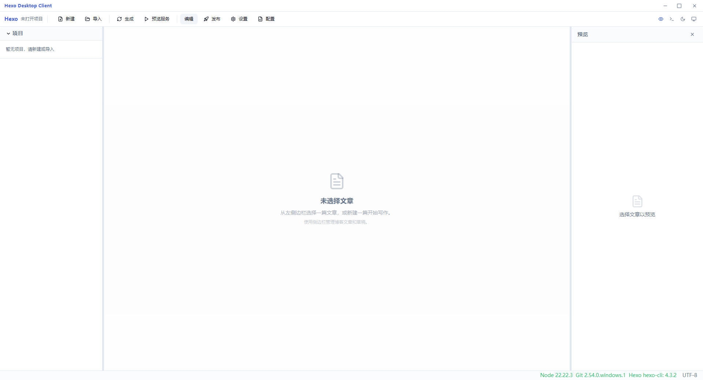

<p align="right"><a href="README_zh-CN.md">中文</a></p>

# Hexo Desktop Client

A modern desktop client for [Hexo](https://hexo.io/) blogs. Write, preview, configure, and deploy — all from a visual interface. No command line needed.

## Features

- **Blog Project Management** — Create, import, and switch between multiple Hexo projects
- **Markdown Editor** — Full-featured editor with live HTML preview, image drag-and-drop, and `marked` rendering
- **Front Matter Editor** — Visual editing for title, date (one-click timestamp), tags, and categories
- **Config File Management** — GUI editor for `_config.yml` (site + theme) with collapsible sections
- **Theme Installer** — Browse popular themes and install with one click via Git clone
- **Live Preview** — Built-in hexo server with auto port detection
- **One-Click Deploy** — Git add/commit/push + hexo deploy, with real-time log output
- **Dark Mode** — Full dark/light/system theme support
- **Environment Check** — Auto-detect Node.js, Git, and Hexo CLI
- **Multi-language** — Chinese (简体中文) and English UI

## Screenshots



## System Requirements

- **Windows 10+** (x64) or **Linux** (x64)
- **Node.js** >= 18.x
- **npm** >= 9.x
- **Git** >= 2.x
- **Hexo CLI** (`npm install -g hexo-cli`)

## Download

Download the latest release from [GitHub Releases](https://github.com/Zcxx0322/HexoDesktopClient/releases).

- **Windows**: `Hexo Desktop Client-1.0.1-Setup-x64.exe`
- **Linux**: `Hexo Desktop Client-1.0.1-x64.tar.gz`

## Quick Start

### Development

```bash
git clone https://github.com/Zcxx0322/HexoDesktopClient.git
cd hexo-desktop-client
npm install
npm run electron:dev
```

### Build

```bash
# Windows installer
node scripts/build.js win

# Linux AppImage (build on Linux)
node scripts/build.js linux
```

## Tech Stack

| Layer | Technology |
|-------|-----------|
| Desktop | Electron 33 |
| Frontend | React 18 + TypeScript + Vite 6 |
| Styling | TailwindCSS 3 + Typography |
| State | Zustand 5 |
| Database | SQLite (better-sqlite3) |
| Git | simple-git |
| Markdown | marked |
| YAML | js-yaml |
| Packaging | electron-builder |

## License

MIT
